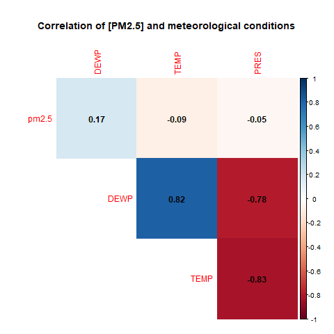
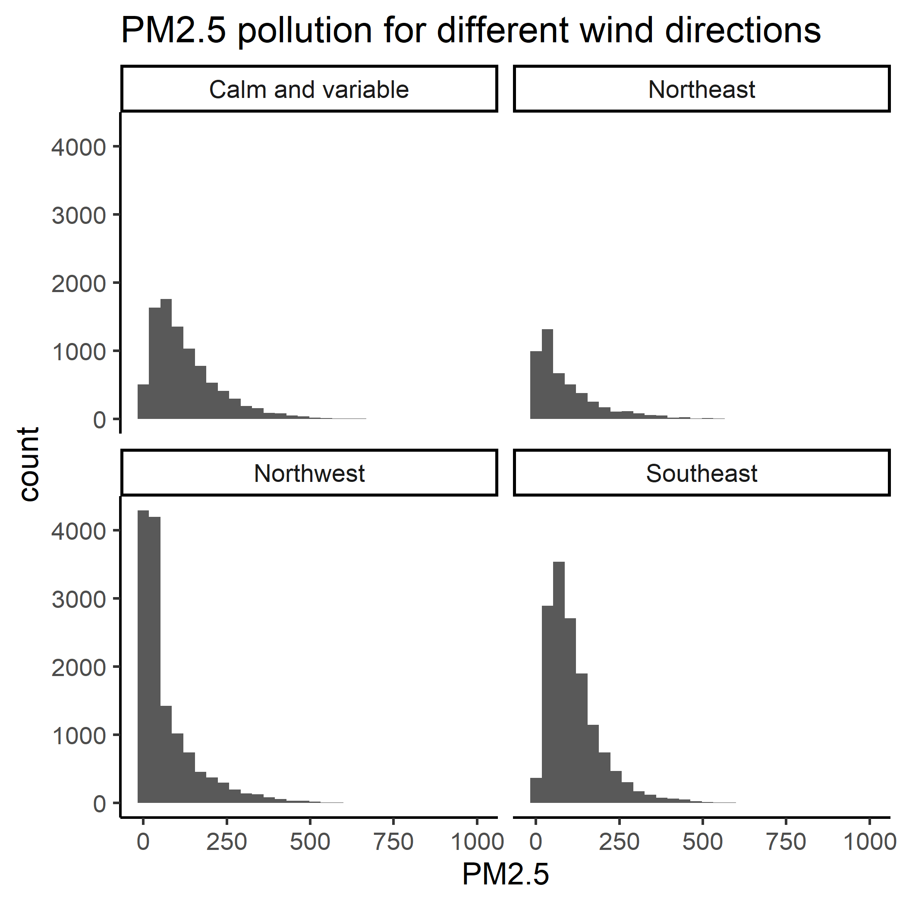
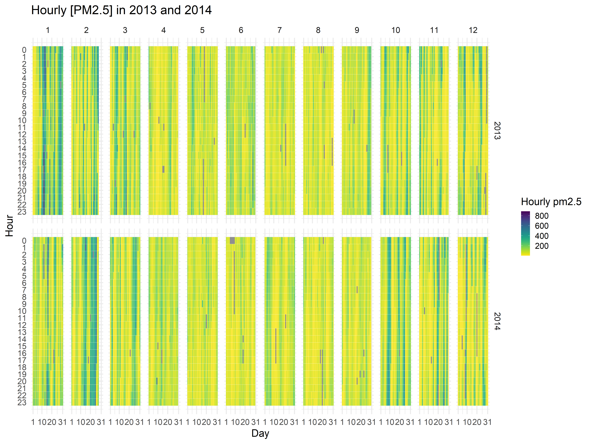
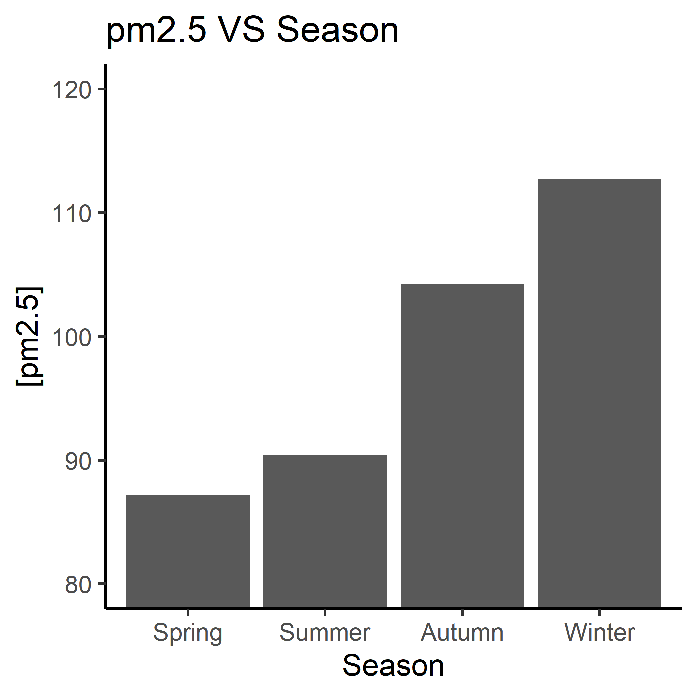
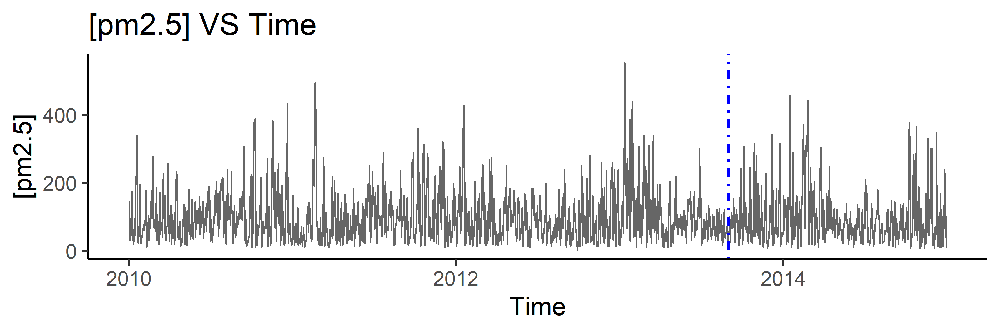
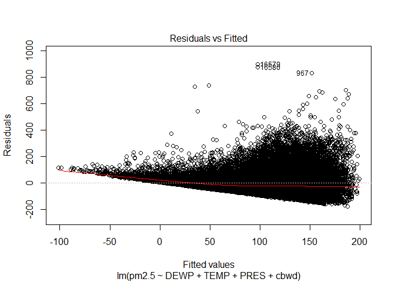
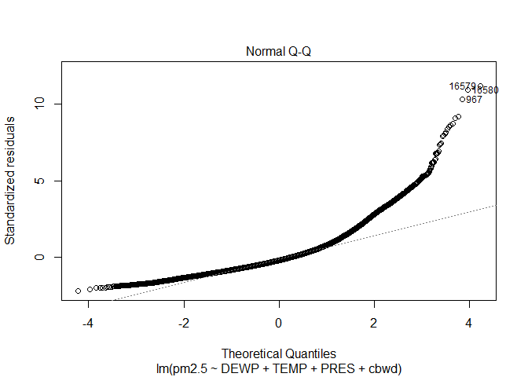
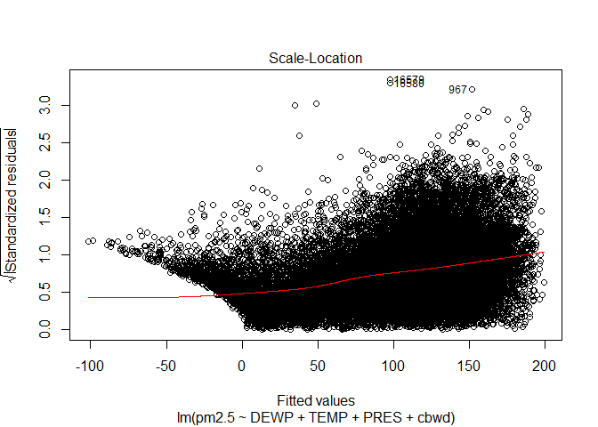
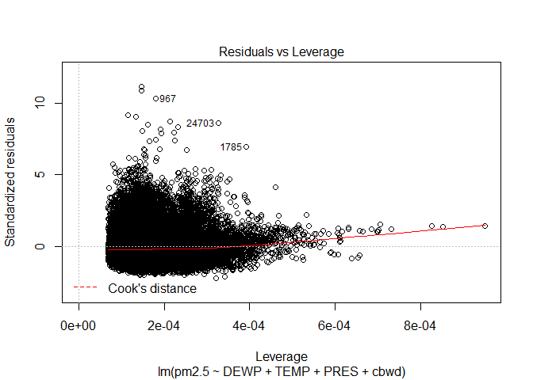

# Beijing PM2.5   
## Introduction  
Beijing, the capital city of China, has been fighting against `PM2.5` pollution in recent years. `PM2.5` are fine airborne particles less than 2.5μm that can cause severe damage to human health by triggering lung cancer, heart diseases, stroke, and respiratory infections. A Nature study pointed out that in 2016 only, `PM2.5` was associated with over four million deaths worldwide. In the past decades, the air quality in Beijing has been faced with great pressure resulting from the rapid development of industry. In order to secure its citizens’ health, Chinese government has taken action to mitigate the influence of `PM2.5` since September, 2013.      
Previous studies showed that meteorological conditions(wind, humidity, etc) could contribute to the formation of `PM2.5`. Therefore, we speculate that there could be correlations between Beijing’s `PM2.5` concentration and the meteorological conditions in a sufficient period of time. 

## Research Question    
Our main research question is an _exploratory_ question: does the `PM2.5` in Beijing correlates with meteorological conditions and time? We speculate that there is indeed a correlation and that knowing the meteorological conditions can support the assessment and even prediction of air quality in Beijing. Sub-questions are as follows:    
-	`PM2.5` VS. physical parameters (dew point, temperature and pressure).    
-	`PM2.5` VS. winds.     
-	`PM2.5` VS. special weather conditions (rain and snow).     
-	`PM2.5` VS. time (year, month, a time in a day). 

## Data Description  
The [dataset](https://archive.ics.uci.edu/ml/machine-learning-databases/00381/PRSA_data_2010.1.1-2014.12.31.csv) we used is from [University of California Irvine Machine learning Repository](https://archive.ics.uci.edu/ml/datasets/Beijing+PM2.5+Data#). It was originally uploaded by Songxi Chen in Peking University, China. This is an hourly dataset containing the `PM2.5` concentration and meteorological statistics in Beijing collected from Jan 1st, 2010 to Dec 31st, 2014.

Below are the variables in the dataset:    

| Variable          | Type             | Description | 
|-------------------|------------------|-------------|
| year              | Quantitative     |Year of data in this row|
| month             | Quantitative     |Month of data in this row|
| day               | Quantitative     |Day of data in this row|
| hour              | Quantitative     |Hour of data in this row|
| `PM2.5`           | Quantitative     |`PM2.5` concentration (ug/m^3)|
| DEWP              | Quantitative     |Dew Point (℃)|
| TEMP              | Quantitative     |Temperature (℃)|
| PRES              | Quantitative     |Pressure (hPa)|
| cbwd              | Categorical      |Combined wind direction|
| lws               | Quantitative     |Cumulated wind speed (m/s)|
| ls                | Quantitative     |Cumulated hours of snow|
| lr                | Quantitative     |Cumulated hours of rain|


## Exploratory data analysis (EDA)
### 1.Correllogram   

Our first step was to check if there are correlations between meteorological conditions and `PM2.5` concentration using a correllogram. The colors in the first row are very shallow and corresponding values are close to zero, indicating weak correlations between `PM2.5` concentration and meteorological conditions.

     

### 2.Faceted histogram	   

Next, we used a faceted histogram to check the distribution of `PM2.5` under different wind directions. The Y axis in the image below is the count of a certain PM2.5 concentration, indicating the severity of PM2.5 pollution. Each facet stands for a wind direction*.      
_Only northeast, southwest, southeast and calm and variable were recorded as the wind direction in the dataset; northwest was somehow missed_       

For different wind directions, the range of `PM2.5` concentration is similar, but the absolute and relative frequency of a specific `PM2.5` concentration are different: northwest and southeast tend to have more recordings of low values.

      


### 3.Heat map


In addition to meteorological conditions, we are curious about the correlation between `PM2.5` concentration and time, so we generated a heat map. No significant color differences were found between years (2013 and 2014) or within a day (morning, afternoon and evening). However, the color varies in different months: October to Februrary tend to have more dark colors compared to the other months.      

     

Inspired by the heat map, we generated two more figures of `PM2.5` concentration focusing on seasons and the trend across years.

### 4.Histogram

The histogram emphasizes the severity of `PM2.5` pollution in different seasons. We can see clearly that with the time going from spring to winter, `PM2.5` concentration rises continously. 

      

### 5.Line chart

The purpose of the line chart was to show the change of `PM2.5` concentration across time. In general, the `PM2.5` concentration seems to fluctuate, and peaks usually take place when new years come. The blue dash line on the left of 2014 shows when the Chinese government launched a plan to fight against the pollution, but it is hard to observe a decrease in `PM2.5` concentration since this time. 



## Analysis methods


```r
lm <- readRDS(file=here::here("docs", "model.rds"))
tidy(lm)
```

```
## # A tibble: 7 x 5
##   term        estimate std.error statistic   p.value
##   <chr>          <dbl>     <dbl>     <dbl>     <dbl>
## 1 (Intercept) 1836.      72.9       25.2   5.25e-139
## 2 DEWP           4.10     0.0518    79.2   0.       
## 3 TEMP          -6.29     0.0675   -93.1   0.       
## 4 PRES          -1.62     0.0712   -22.8   2.52e-114
## 5 cbwdNE       -28.9      1.45     -20.0   2.78e- 88
## 6 cbwdNW       -39.9      1.13     -35.1   9.70e-267
## 7 cbwdSE         0.435    1.10       0.397 6.92e-  1
```

```r
plot(lm)
```

<!-- --><!-- --><!-- --><!-- -->

Judging by the plots, we can tell that this model has huge residuals and cannot predict pm2.5 well.


## Results (placeholder, will be adjusted later)   

In a nutshell, we find that `PM2.5` concentration is more likely to change with time instead of meteorological conditions, which is rather surprising as previous studies have shown correlation between `PM2.5` and weather variables. Our first finding is that the correlations between dew point (DEWP), temperature (TEMP) or pressure (PRES) and `PM2.5`concentration are rather weak (Figure 1), so the meteorological conditions can hardly predict the `PM2.5` concentration.     

In addition to the meteorological conditions studied above, wind is also one of the important factors that can influence the formation of `PM2.5`. According to Figure 2, `PM2.5` concentration seems to have a similar range for all wind directions; and the pollution is less serious when the wind comes from northwest and southeast.     

`PM2.5` concentration changes within a year (Figure 3 and 4). The pollution is more serious when it enters October and reaches its peak in January/February. Besides, we didn't find significant differences across years (Figure 3 and 5) or within a day.  

## Discussion

The weak correlations between `PM2.5` concentration and meteorological conditions in Figure 1 are surprising to us as we suspected that they should be strong. Based on [previous studies](https://www.atmos-chem-phys.net/18/5343/2018/acp-18-5343-2018.pdf), temperature and pressure are positively correlated with `PM2.5` while humidity (dew points in this study) is negatively correlated. This contradictory finding may result from the limitation of `corrplot()`, and further analyses such as t-test are needed to study the correlations.     

Regardless of the wind direction, we found that `PM2.5` concentration ranges from 0 to 994 and that during most of the time it is below 72 (median). However, the severity of `PM2.5` pollution differs across wind directions: when the wind comes from the northwest, the severity seems to be the lowest, as lower PM2.5 concentrations are more likely to occur. In comparison, winds coming from the northeast tend to result in more serious pollution. We find this also surprising, since the northernwest part of China are covered with more sand compared to the northeast, which consists mostly of soil. This might because of the number of recordings (absolute frequency) varies for different wind directions, and more data is needed for further verification of this result.

We attempted to see if there is any decrease in `PM2.5` concentration that could possibly result from a plan of Chinese government that aims to improve the air quality, which started in September in 2013. However, we didn't find differences between 2013 and 2014, though there is a slight drop in the mean of`PM2.5` concentration(before: 104.1933921; after: 97.4906558). The highest value happened in 2013, which could possibly explain the government's motivation to reduce the pollution, but it is hard to find an observable decrease. This is reasonable since there could be lag for the action to come into effect, and more data after 2014 is needed. 

`PM2.5` pollution is more serious when it enters October and reaches its peak in January/February. It is also worth noticing that the increase between summer and autumn is the largest, suggesting that some conditions changing at this time have greater contribution to the formation of `PM2.5`, such as wind direction, temperature and dew point, though the last two are not found to be correlated strongly with `PM2.5` based on the correlogram. This finding is similar to previous studies that point out that the worst case happens in autumn and winter. It is reasonable when taking the conclusion drawn above about the impact of the wind direction into account: located in the northern part of China, Beijing experiences the wind coming from the north from September to early March, which can result in a more serious pollution. In comparison, the wind comes from the south from late March to August, leading to less formation of `PM2.5` particles, so the air condition is better.      

By comparing different hours within a day, we were considering if `PM2.5` concentration is higher in the morning and evening but lower at noon. However, although our hypothesis can be true in some winter days, `PM2.5` concentration seems to be stable within a day during most of the time. 

### References
Liang, X., Zou, T., Guo, B., Li, S., Zhang, H., Zhang, S., Huang, H. and Chen, S. X. (2015). Assessing Beijing's PM2.5 pollution: severity, weather impact, APEC and winter heating. Proceedings of the Royal Society A, 471, 20150257.
